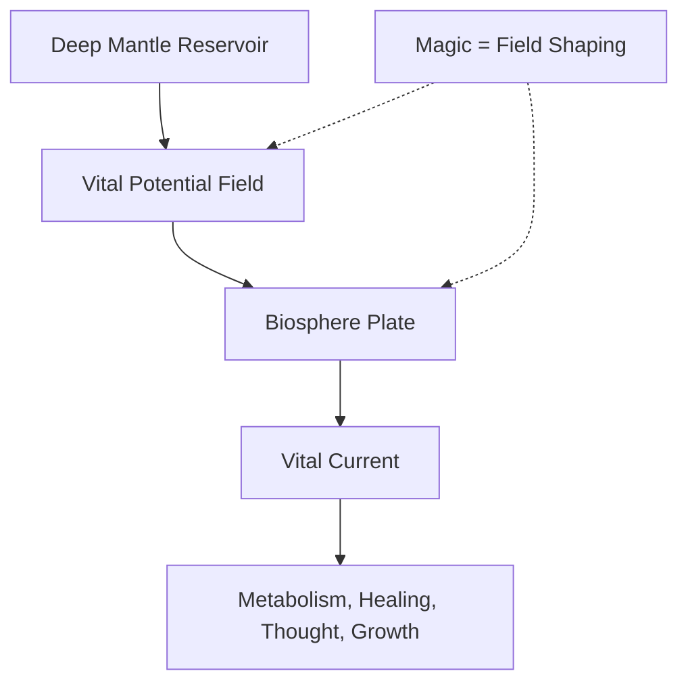
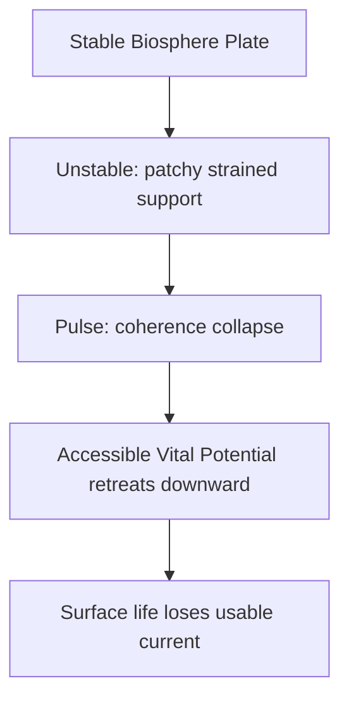
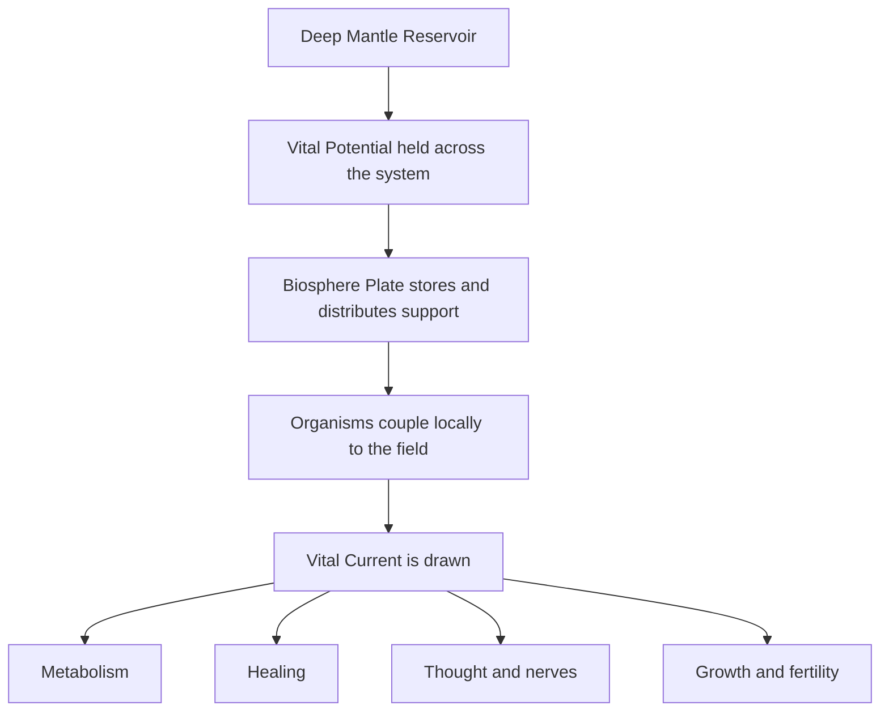

# The Vital Gradient

> - **Purpose:** Canon reference for the Vital field model that underlies life, collapse, and stabilization across the setting.
> - **Short Version:** The world holds a deep Vital reservoir below and a living biosphere above. Life draws usable Vital Current through the field between them. A Pulse happens when that surface system loses coherence.
> - **Use:** Reference this file when explaining the cosmology, Pulse behavior, Grey Bloom, Dormancy, or the role of magic.

## Core Model

The world is sustained by a Vital field held between a deep mantle reservoir and the living biosphere above.

This is the basic model:

1. The planet holds a deep Vital reservoir.
2. The biosphere forms a living surface structure that can hold and distribute support.
3. Organisms couple locally to that structure.
4. Usable Vital Current is drawn into metabolism, healing, thought, growth, fertility, ecological cycling, and stable magic.

Life does not create Vitality from nothing.

Life forms the living structure that can hold, distribute, and draw on it.

## Term Map

| Term | Meaning | Notes |
| --- | --- | --- |
| Vital Potential | Stored life-supporting potential in the coupled planetary system | Not a separate pool from the field-state; the stored support of the whole system |
| Vital Gradient | The difference in availability between deep reservoir and surface life | The broad term most people use for the entire phenomenon |
| Vital Current | The active usable flow organisms draw | Powers living activity directly |
| Biosphere Plate | The living surface layer that holds and distributes support | Non-ideal, living, patchy, self-repairing, and fragile |
| Deep Mantle Reservoir | The lower source and sink of Vital support | The deep anchor of the world-system |
| Pulse | Collapse of biosphere-plate coherence | Surface support fails and accessible Vital Potential retreats downward |

## How Life Uses It

Life draws on Vital Potential the way roots draw on groundwater or organs draw on blood pressure.

Vital Current supports:

- metabolism
- healing
- neural activity and thought
- growth and reproduction
- ecological cycling
- stable magical working

In practical setting terms, life stores it, channels it, and draws on it. 

***Internally it wills the biological cells carry out tasks to sustain life.***

## The Role of Magic

Magic is not the Vital Current itself.

Magic shapes the field through which Vitality is accessible.

Magic can:

- align the field
- focus flow
- redirect access
- gate weak regions
- force resonance
- distort or scar the field when misused

This matters because current draw and magical strain are related but not identical.

- Life draws the current.
- Magic shapes the field.
- Excessive draw weakens coherence.
- Excessive distortion destabilizes coherence.

## Stable, Unstable, and Collapse States

### Stable

In a stable state, the biosphere plate is coherent and healthy.

```text
Deep mantle reservoir
        ↑
Strong Vital Gradient held across the world
        ↑
Healthy biosphere plate stores and distributes support
        ↑
Organisms draw Vital Current
        ↑
Metabolism, healing, growth, thought, fertility, stable magic
```

- Fertility is strong.
- Recovery from injury is reliable.
- Minds and nerves remain clear.
- Ecosystems are resilient.
- Magic behaves consistently.

### Unstable

In an unstable state, the biosphere plate still exists, but it is strained and uneven.

```text
Deep mantle reservoir
        ↑
Vital Gradient still exists, but fluctuates
        ↑
Biosphere plate becomes patchy, thin, and stressed
        ↑
Organisms draw current unevenly
        ↑
Fatigue, weaker recovery, sterile zones, ecological failure, unstable magic
```


- Recovery slows.
- Crops fail unpredictably.
- Magical surges or dead zones appear.
- Mental fog and nervous instability increase.
- Ecologies become patchy and brittle.

### Pulse

A Pulse is a field-collapse event in which the biosphere can no longer function as the planet's upper Vital plate.

When that happens:

- field coherence breaks
- surface support collapses
- accessible Vital Potential retreats downward toward depth
- usable Vital Current fails at the surface

The Pulse does not kill by heat, plague, or radiation.

It lowers the complexity ceiling until whatever was barely sustainable fails first.

```text
Before Pulse:
Deep reservoir ↔ surface biosphere field held in tension

At Pulse:
Field coherence breaks
        ↓
Surface support collapses
        ↓
Accessible Vital support retreats downward
        ↓
Surface life loses access
```

During the Pulse:

```text
Deep mantle reservoir becomes dominant sink
        ↓
Surface field collapses inward / downward
        ↓
Vital Current fails at the surface
        ↓
Metabolism, healing, thought, growth, and magic begin failing
```

## What Downward Retreat Means

It means the life-supporting field that was available across the surface becomes less available there and re-concentrates toward the deep reservoir.

The best analogy is a falling water table:

- the water still exists
- but it is now too deep for the roots to reach

After a Pulse, the Vital support is still in the planetary system, but it is no longer accessible to surface life in the same way.

## Grey Bloom and Dormancy

### Grey Bloom

Grey Bloom means local surface support has fallen below a sustainable threshold.

- Decay stops.
- Insects vanish.
- Sound feels muted.
- Corpses remain intact instead of breaking down.
- Wounds stop closing at a normal pace.

Grey Bloom is not ordinary death.

It is ecological standstill caused by loss of usable surface access.

### Dormancy

Dormancy means local mantle-biosphere coupling is too weak for ordinary surface life to use.

- Microbial activity fails.
- Natural healing collapses.
- Regrowth stops.
- Stable magic becomes weak, rare, or distorted.

Dormancy is not annihilation.

It is disconnection.

## How Strain Builds

The biosphere plate is living and non-ideal.

That means heavy demand does not merely spend support. It can also weaken the surface system's ability to remain coherent enough for future draw.

The model is:

1. Life draws Vital Current from the field.
2. If draw is too high for too long, recharge and coherence fall behind.
3. Magic at scale can further distort field alignment.
4. The biosphere depolarizes unevenly.
5. Surface support becomes patchy and unstable.

```text
Life draws Vital Current from the field
        ↓
If draw is too high for too long, recharge and coherence fall behind
        ↓
The biosphere depolarizes unevenly
        ↓
Surface support becomes patchy and unstable
```

Civilization accelerates this process because it concentrates population, arcane industry, infrastructure, and magical demand into the same living system.

## Why Pulses Accelerate

Pulses come faster when the biosphere plate is already patchy and weakened.

Each Pulse:

1. strips coherence from regions that were already thin
2. deepens phase mismatch between neighboring regions
3. makes future draw harder to sustain cleanly
4. shortens the time until the next threshold failure

The world is not simply emptying.

It is losing its ability to hold planetary tension as a unified whole.

## Recovery After a Pulse

A Pulse does not mean the biosphere plate ceases to exist forever.

Some mantle-biosphere tension can re-establish after collapse, but often at a weaker, patchier, lower-complexity level than before.

Recovery usually falls into one of three outcomes:

1. Full recovery: the field restores strongly.
2. Partial recovery: support returns, but weaker and with a lower complexity ceiling.
3. Failed recovery: some regions never regain enough coherence and remain dormant or blighted.

For this setting, partial recovery is the strongest default.

## Canon Definitions

> **Pulse:** A field-collapse event in which the biosphere can no longer function as the planet's upper Vital plate, causing surface support to fail and accessible Vital Potential to retreat downward toward depth.

> **Magic:** Not the Vital Current itself, but the art of shaping the field through which Vitality is accessible: aligning, focusing, bending, gating, and resonating it.

> **Life:** It does not create Vitality from nothing. It forms the living structure that can hold, distribute, and draw on Vital Potential.

## GitHub-ready Mermaid diagrams

### Core model



### Stable → Unstable → Pulse



### How life draws on Vital Potential

